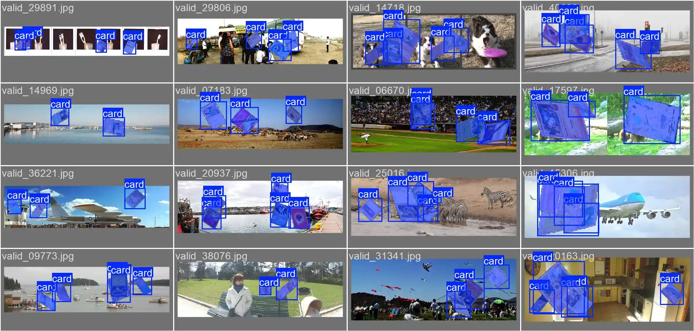
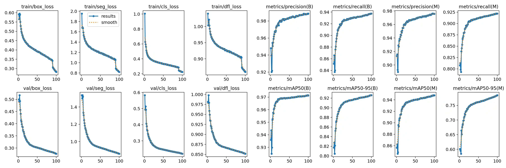
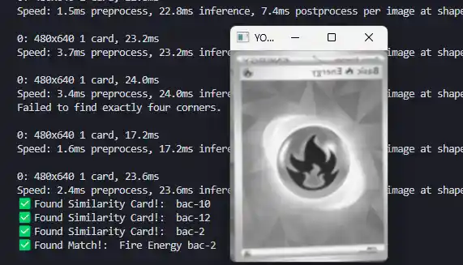

# TCG Scanner

  

A real-time trading card scanner that uses segmentation, perspective correction, and image hashing to identify cards without relying on text recognition. This project is a proof of concept for a future React Native app that enables fast, on-device scanning for collectors. *(Work in progress 🏗️)*

## Card Detection with Segmentation

Most object detection models produce bounding boxes, but these often capture too much background, especially when cards are tilted, skewed, or overlapping. This makes it difficult to reliably isolate the card itself.

To fix this, I trained a segmentation model to pinpoint the exact pixels of each card using a mask. This approach allows for more precise isolation and downstream processing.

### Training Details

I created a dataset of 50,000 synthetic images by layering 2–5 card crops over random backgrounds. Each card was randomly rotated, scaled, skewed, and adjusted for brightness, blur, and overlap to simulate real-world conditions. Here's an example from the validation set:

  

The model trained over 100 epochs (8 hours total). Performance began to level off after 40 epochs, with only slow improvements beyond that point. Final evaluation:

* **Bounding Box mAP**: 0.97
* **Segmentation mAP**: 0.94

Below is a training loss curve that shows rapid early improvement before stabilizing, likely due to the cards' simple shapes.

  

## Perspective Correction

Once cards are segmented, they’re often distorted due to camera angle or perspective. To normalize them, I apply a perspective transform that straightens and orients each card to appear as if viewed head-on.

This involves:

* Detecting contours in the binary mask
* Filtering out shapes that aren’t rectangular
* Identifying the card’s four corners
* Warping the image so the card fits the canvas in portrait orientation

## Matching via Image Hashing

To identify the card, we compare it to a local database using image hashing — a technique that converts an image into a short string based on its visual appearance. Similar images produce similar hashes, even if they’re slightly blurry, rotated, or poorly lit.

### Challenges & Solution

Using a single 16-byte hash (e.g., perceptual hash) caused too many false matches due to hash collisions, especially with a 20,000+ card dataset. To solve this, I:

* Combined **difference hash** and **perceptual hash**
* Increased the hash length to improve uniqueness
* Used a **Hamming distance** threshold to allow slight image variation

If no match is found initially, the image is flipped 180° and reprocessed to account for upside-down cards.

  

## Conclusion

This scanner combines deep learning, OpenCV, and image hashing to quickly identify trading cards from real-world images. It’s designed to help collectors avoid manual entry and speed up cataloging — especially at events or in bulk.

## Next Steps

* Support additional TCGs
* Add pricing integrations (eBay, TCGPlayer, etc.)
* Integrate with a React Native mobile app

## Acknowledgements

* [OpenCV](https://opencv.org/)
* [YOLO (Ultralytics)](https://docs.ultralytics.com/models/)
* [ImageHash (Python)](https://pypi.org/project/ImageHash/)
* [COCO Dataset](https://cocodataset.org/#download)
* [TCGCSV](https://tcgcsv.com/)
* Inspiration: [jslok/card-scanner](https://github.com/jslok/card-scanner)
